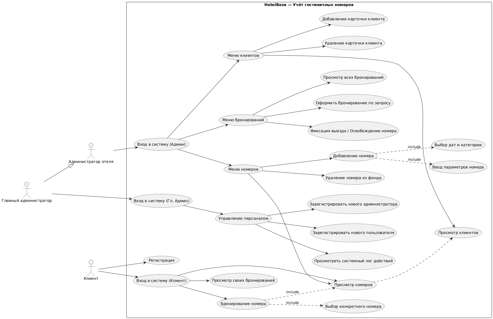

# Информационная система учёта гостиничных номеров «HotelBase»

<p align="center">
  
  
  
  
</p>

---

> **HotelBase** — программный комплекс, предназначенный для централизованного учёта номерного фонда отеля, оперативного контроля и фиксации бронирований, предотвращения овербукинга и разграничения прав доступа персонала и гостей гостиничного комплекса.

Проект разрабатывается в рамках лабораторного практикума по дисциплине **«Информатика»** на кафедре *«Вычислительные системы и технологии»* (ИРИТ, НГТУ им. Р.Е. Алексеева).

---

## 📋 Оглавление
- [Информационная система учёта гостиничных номеров «HotelBase»](#информационная-система-учёта-гостиничных-номеров-hotelbase)
  - [📋 Оглавление](#-оглавление)
  - [🎯 Цель и задачи проекта](#-цель-и-задачи-проекта)
    - [Ключевые задачи системы:](#ключевые-задачи-системы)
  - [👥 Роли пользователей и матрица доступа](#-роли-пользователей-и-матрица-доступа)
  - [⚙️ Функциональные возможности](#️-функциональные-возможности)
  - [🏗 Архитектура системы](#-архитектура-системы)
  - [📊 Моделирование процессов](#-моделирование-процессов)
    - [Диаграмма прецедентов (Use Case)](#диаграмма-прецедентов-use-case)
    - [Ключевые алгоритмы работы:](#ключевые-алгоритмы-работы)
  - [📁 Структура репозитория](#-структура-репозитория)
  - [🚀 Установка и запуск](#-установка-и-запуск)
    - [Системные требования](#системные-требования)
    - [Инструкция по развёртыванию](#инструкция-по-развёртыванию)
  - [👨‍💻 Сведения об авторе](#-сведения-об-авторе)

---

## 🎯 Цель и задачи проекта

**Цель разработки:** создание программного механизма для централизованного учёта ресурсов гостиницы (номерного фонда) и надёжной регистрации фактов их бронирования в едином цифровом пространстве.

### Ключевые задачи системы:
* **Автоматизация учёта номеров:** создание, изменение характеристик (категория, вместимость, стоимость суток, текущий статус) и удаление объектов номерного фонда в единой базе данных.
* **Разграничение прав доступа:** обеспечение безопасного авторизованного входа и защита персональной информации за счёт ролевой модели.
* **Поиск и фильтрация свободных номеров:** предоставление персоналу и клиентам актуальной выборки доступных комнат по заданным параметрам (*дата*, *цена*, *вместимость/класс*).
* **Фиксация и контроль бронирований:** регистрация периодов заселения с программной валидацией, исключающей наложение дат на один и тот же номер (*защита от овербукинга*).
* **Управление учётными записями:** предоставление главному администратору инструментов администрирования учётных записей сотрудников отеля.

---

## 👥 Роли пользователей и матрица доступа

В системе реализована ролевая модель доступа (**RBAC**), разделяющая полномочия на три уровня:

| Роль | Права | Описание и доступные функции |
| :--- | :---: | :--- |
| **Главный администратор** *(Суперадмин)* | **Full Access** *(Полный доступ)* | Регистрация учётных записей сотрудников (администраторов) и пользователей, просмотр системного лога действий, полный доступ ко всем функциям управления отелем. |
| **Администратор отеля** *(Персонал)* | **RW** *(Управление ресурсами)* | Управление базой номеров (добавление, редактирование, удаление из фонда), создание и отмена бронирований по запросу гостей, фиксация выезда / освобождение номеров, просмотр истории бронирований и карточек клиентов. |
| **Клиент** *(Гость)* | **User** *(Клиентский доступ)* | Самостоятельная регистрация и авторизация в системе, поиск свободных номеров по датам и параметрам, бронирование выбранного номера на своё имя, просмотр статуса собственных броней. |

---

## ⚙️ Функциональные возможности

Комплекс функций системы сгруппирован по бизнес-модулям:

1. **Управление номерным фондом:**
   * Добавление нового номера в базу данных с указанием категории, вместимости и суточной стоимости;
   * Редактирование параметров и статуса готовности номера к заселению;
   * Удаление номера из активного фонда с проверкой ограничений внешних ключей (отсутствие активных броней).
2. **Бронирование и размещение:**
   * Оформление заявки на бронирование клиентом или администратором по запросу;
   * Автоматическая проверка пересечения периодов проживания (предотвращение двойного бронирования);
   * Смена статусов брони (*оплачено*, *отменено*, *заселен*, *выезд/освобожден*).
3. **Поиск и подбор номеров:**
   * Фильтрация свободного фонда по диапазону дат заезда/выезда, категории комфорта и вместимости;
   * Отображение детальной информации по выбранному номеру.
4. **Управление доступом и клиентами:**
   * Регистрация и аутентификация клиентов и персонала;
   * Ведение карточек клиентов (контактные и персональные данные);
   * Ведение системного журнала операций (аудит действий).

---

## 🏗 Архитектура системы

Программный комплекс строится по принципам классической **трёхуровневой архитектуры** (*3-Tier Architecture*):

```
┌────────────────────────────────────────────────────────┐
│         Слой интерфейса (Presentation Layer)           │
│     Экранные формы ввода, таблицы номеров и броней     │
└───────────────────────────┬────────────────────────────┘
                            │ (DTO / Команды ввода)
┌───────────────────────────▼────────────────────────────┐
│        Слой бизнес-логики (Business Logic Layer)       │
│  Валидация дат, алгоритмы овербукинга, контроль ролей  │
└───────────────────────────┬────────────────────────────┘
                            │ (CRUD / Запросы к БД)
┌───────────────────────────▼────────────────────────────┐
│                Слой данных (Data Layer)                │
│       Реляционная БД: таблицы номеров, броней,         │
│                 пользователей и клиентов               │
└────────────────────────────────────────────────────────┘
```

* **Слой интерфейса (Presentation Layer):** отвечает за приём команд ввода от пользователя (окна авторизации/регистрации, экранные формы задания параметров номера, интерактивные таблицы со списками броней) и вывод информационных сообщений.
* **Слой бизнес-логики (Business Logic Layer):** содержит модули валидации входных данных, алгоритмы проверки пересечения дат бронирования на предмет овербукинга, валидацию паролей и разграничение прав доступа в соответствии с ролью.
* **Слой данных (Data Layer):** отвечает за персистентность, физическое хранение и структурирование сущностей (номера, бронирования, учётные записи, клиенты) в реляционных таблицах с обеспечением ссылочной целостности.

---

## 📊 Моделирование процессов

### Диаграмма прецедентов (Use Case)
Отражает сценарии взаимодействия Главного администратора, Администратора отеля и Клиента с системой «HotelBase»:

<p align="center">
  
</p>

> Исходный декларативный код диаграммы сохранён в формате PlantUML: [`docs/diagrams/usecase.puml`](docs/diagrams/usecase.puml).

### Ключевые алгоритмы работы:
* **Алгоритм добавления нового номера Администратором:**
  1. Проверка авторизации и наличия роли `Администратор`;
  2. Ввод данных номера (порядковый номер, тип/категория, стоимость, вместимость);
  3. Поиск номера в базе данных: если номер уже найден — вывод ошибки *«Такой номер уже существует»*;
  4. При отсутствии дубликата — атомарное создание записи в БД и вывод сообщения *«Номер успешно создан»*.
* **Алгоритм оформления бронирования номера Клиентом:**
  1. Проверка факта авторизации пользователя в системе;
  2. Ввод данных желаемого номера отеля и дат проживания;
  3. Поиск номера в БД: если объект не найден — вывод ошибки *«Номер не найден»*;
  4. Проверка статуса бронирования и пересечения дат: если номер занят на указанный период — вывод ошибки *«Номер уже забронирован»*;
  5. При успешной проверке доступности — сохранение брони в БД и вывод сообщения *«Номер успешно забронирован»*.

---

## 📁 Структура репозитория

```text
hotelbase/
├── .gitignore               # Исключения системных и временных файлов
├── README.md                # Главный документ проекта (документация)
├── docs/                    # Проектная документация и материалы отчёта
│   └── diagrams/            # Исходники и схемы процессов
│       ├── usecase.puml     # Use Case код на языке PlantUML
│       ├── usecase.png      # Диаграмма прецедентов      
├── src/                     # Исходный программный код
│   └── main.py              # Точка входа в приложение (прототип системы)

```

---

## 🚀 Установка и запуск

### Системные требования
* **Интерпретатор / Среда:** Python 3.10+
* **Система контроля версий:** Git 2.40+

### Инструкция по развёртыванию

1. **Клонировать репозиторий на локальную машину:**
   ```bash
   git clone https://github.com/RADiant-Git/HotelBase.git
   cd HotelBase
   ```

2. **Запустить исходную версию программы:**
   ```bash
   python src/main.py
   ```

---

## 👨‍💻 Сведения об авторе

* **Выполнил:** студент Петров И. А.
* **Учебная группа:** 26-ИВТ-4-1
* **ВУЗ:** НГТУ им. Р.Е. Алексеева (Нижний Новгород)
* **Институт:** ИРИТ
* **Кафедра:** «Вычислительные системы и технологии»
* **Дисциплина:** Информатика (Лабораторная работа №1)
* **Проверил:** ассистент Китов А. А.
* **Год выполнения:** 2026